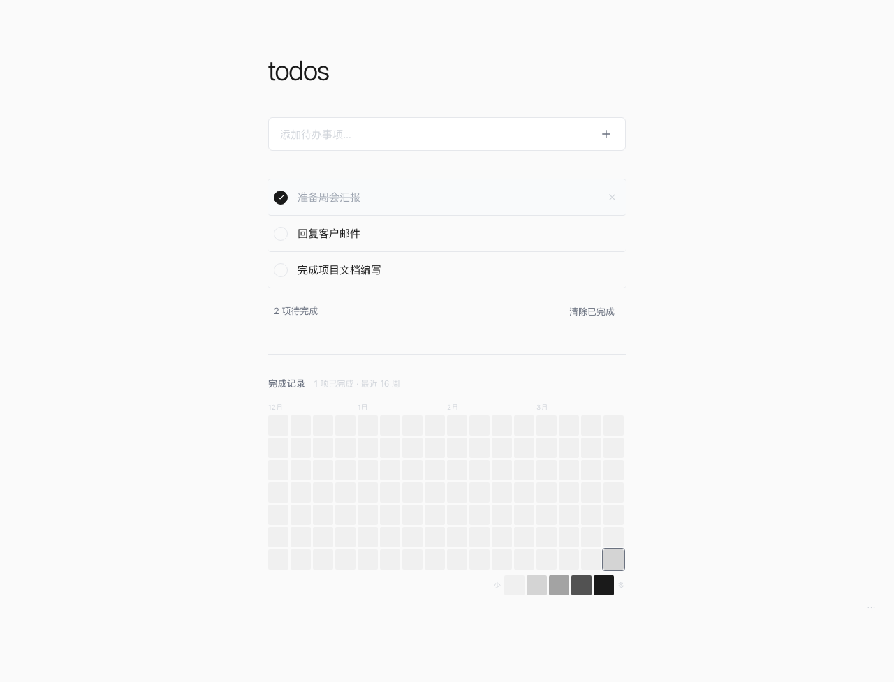
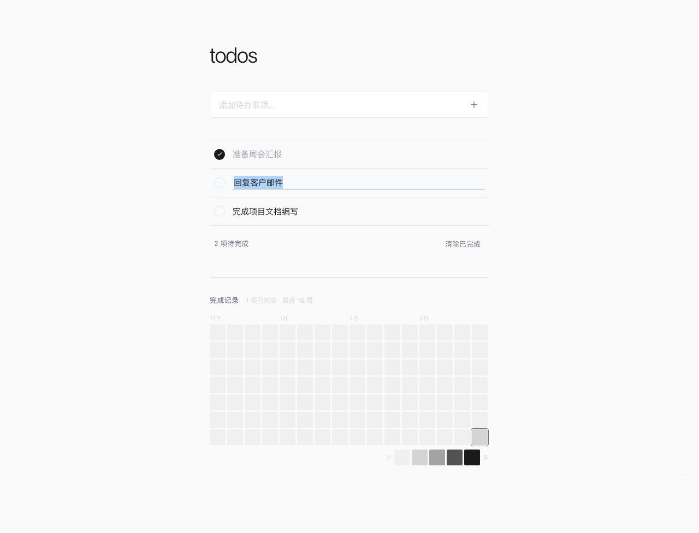
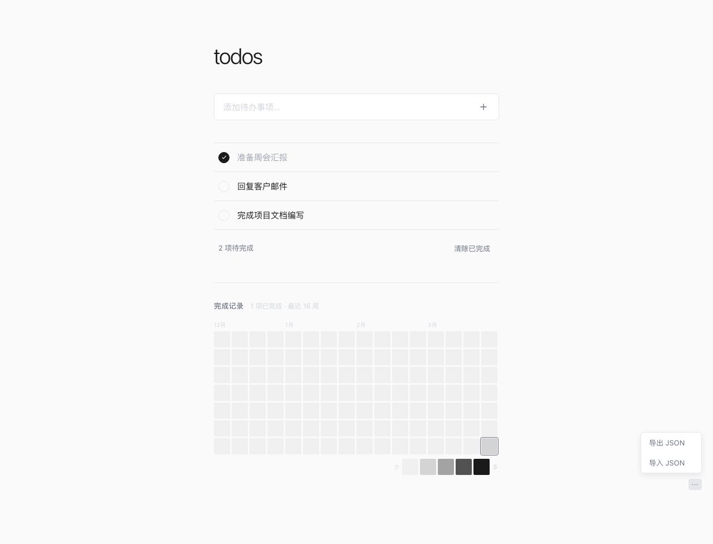

# Todos

> 极简待办清单 —— 一个专注于效率的轻量级任务管理工具

[](https://drrreistein.github.io/todos/)
[](LICENSE)



---

## ✨ 产品特性

### 1. 极简设计
黑白灰配色，无干扰界面，让你专注于任务本身。

- 清爽的输入框，支持 Enter 快速添加
- 优雅的复选框动画
- 已完成项目自动添加删除线
- 底部状态栏实时显示待完成数量

### 2. 智能输入
- **中文 IME 兼容**：输入法选字期间回车不会误提交
- **快速添加**：输入后按 Enter 或点击 + 按钮立即创建

### 3. 行内编辑
双击任意待办事项即可进入编辑模式：



- **Enter** 保存修改
- **Esc** 取消编辑
- **失焦** 自动保存
- 支持中文输入法，组字期间不会误提交

### 4. 每日完成热力图
GitHub 风格的贡献热力图，直观展示你的工作效率：

- **16 周历史**：展示最近 112 天的完成情况
- **五级色阶**：从浅灰到深黑，完成越多颜色越深
- **今日高亮**：当天格子有特殊边框标记
- **悬停提示**：鼠标悬停显示具体日期和完成数量

上图中的热力图区域展示了这一功能。

- **16 周历史**：展示最近 112 天的完成情况
- **五级色阶**：从浅灰到深黑，完成越多颜色越深
- **今日高亮**：当天格子有特殊边框标记
- **悬停提示**：鼠标悬停显示具体日期和完成数量

### 5. 数据导入导出
右下角隐藏的 `···` 菜单提供数据管理功能：



| 功能 | 说明 |
|------|------|
| 📤 导出 JSON | 下载所有待办数据，包含时间戳和完成记录 |
| 📥 导入 JSON | 从备份文件恢复，智能合并去重 |

```
导出文件格式: todos-2026-03-31.json
[
  {
    "id": "uuid",
    "text": "待办内容",
    "completed": true,
    "createdAt": 1711881600000,
    "completedAt": 1711968000000
  }
]
```

### 6. 本地持久化
所有数据自动保存到浏览器 localStorage：
- ✅ 刷新页面不丢失
- ✅ 离线可用
- ✅ 隐私安全（数据不上传云端）

---

## 🚀 快速开始

### 在线使用
直接访问：https://drrreistein.github.io/todos/

### 本地开发

```bash
# 克隆仓库
git clone https://github.com/Drrreistein/todos.git
cd todos

# 安装依赖
npm install

# 启动开发服务器
npm run dev

# 构建生产版本
npm run build
```

---

## 🛠 技术栈

- **框架**: React 18 + TypeScript
- **构建**: Vite 5
- **样式**: 纯 CSS（无 UI 框架）
- **状态**: useReducer + localStorage
- **部署**: GitHub Pages

---

## 📝 更新日志

### v1.1 (2026-03-31)
- ✨ 新增每日完成热力图
- ✨ 新增行内编辑功能
- ✨ 新增数据导入/导出
- 🐛 修复中文输入法回车 Bug

### v1.0 (2026-03-31)
- ✅ 基础待办功能（增删改查）
- ✅ localStorage 持久化
- ✅ 完成状态切换
- ✅ 清除已完成
- ✅ 待完成数量统计

---

## 📄 开源协议

MIT License © 2026 Drrreistein
